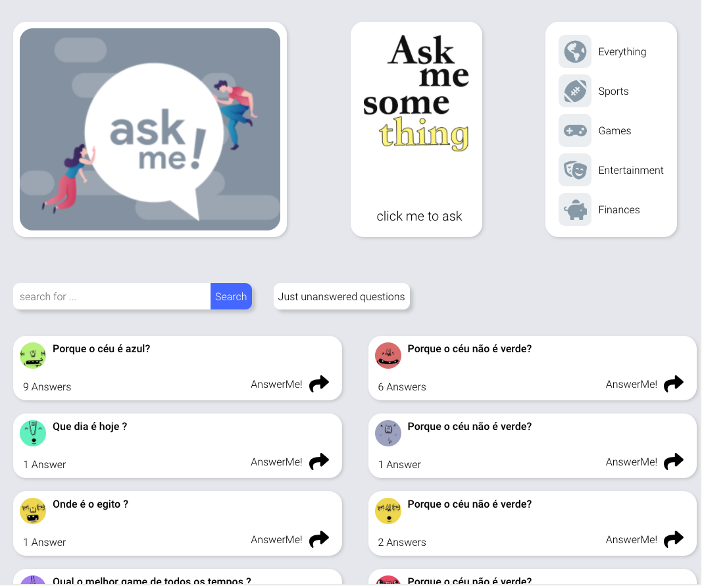
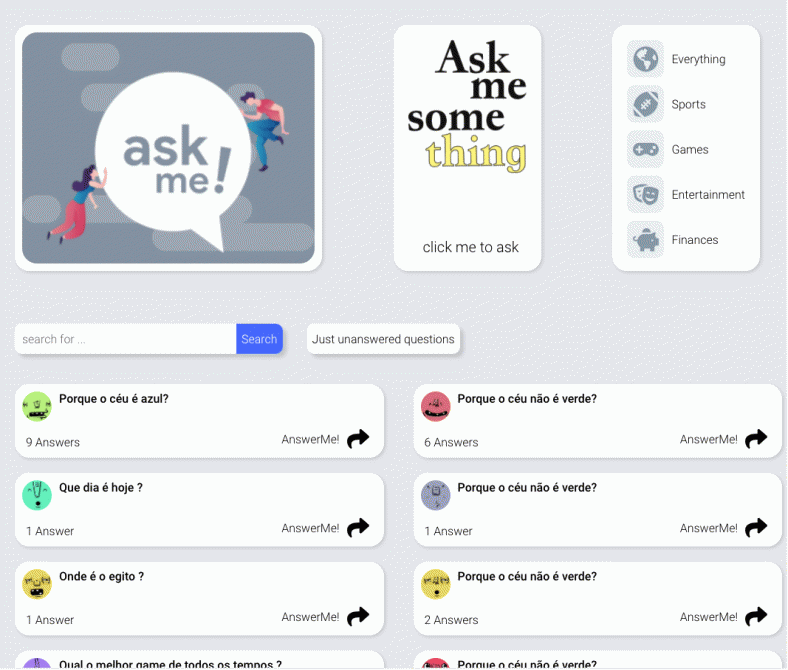

<h1 align="center">
    <br>
    Ask Me Something &nbsp; :question:
</h1>

<h4 align="center">
  A site where you can discover all the answers.
</h4>

<p align="center">
  <a href="#rocket-technologies">Technologies</a>&nbsp;&nbsp;&nbsp;|&nbsp;&nbsp;&nbsp;
  <a href="#information_source-how-to-use">How To Use</a>&nbsp;&nbsp;&nbsp;|&nbsp;&nbsp;&nbsp;
  <a href="#sunny-result">Result</a>
</p>

<h1 align="center">
    
    <br>
</h1>


## :rocket: Technologies

This project was developed with the following technologies:

-  [ReactJS](https://reactjs.org/)
-  [Axios](https://github.com/axios/axios)
-  [Polished](https://polished.js.org/)
-  [React-Toastify](https://fkhadra.github.io/react-toastify/)
-  [styled-components](https://www.styled-components.com/)
-  [React-Icons](https://react-icons.netlify.com/)
-  [Prettier](https://prettier.io/)
-  [VS Code][vc] with [EditorConfig][vceditconfig] and [ESLint][vceslint]

## :information_source: How To Use

To clone and run this application, you'll need [Git](https://git-scm.com), [Node.js v10.16][nodejs] or higher + [Yarn v1.13][yarn] or higher installed on your computer. From your command line:

```bash
# Clone this repository
$ git clone https://github.com/rodolfomori/ask-me-something-interface.git

# Go into the repository
$ cd ask-me-something-interface

# Install dependencies
$ yarn or npm install

# Run the app
$ yarn start
```

## :sunny: Result


<h3 align="center">Mobile</h3>
<h1 align="center">
    
    <br>
</h1>

  <h3 align="center">Desktop</h3>
<h1 align="center">
    
    <br>
</h1>
----

Made with ♥ by Rodolfo Mori :wave: [Get in touch!](https://www.linkedin.com/in/rodolfomori/)

[nodejs]: https://nodejs.org/
[yarn]: https://yarnpkg.com/
[vc]: https://code.visualstudio.com/
[vceditconfig]: https://marketplace.visualstudio.com/items?itemName=EditorConfig.EditorConfig
[vceslint]: https://marketplace.visualstudio.com/items?itemName=dbaeumer.vscode-eslint
